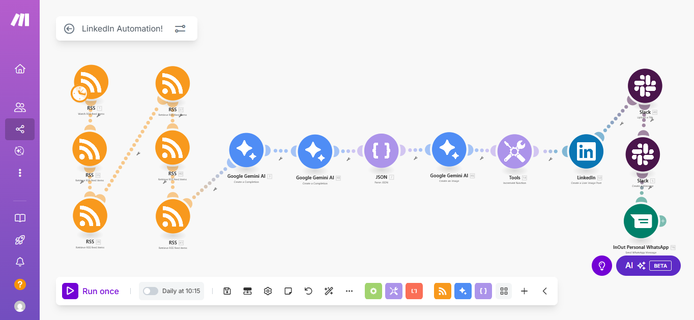

# LinkedIn AI Content Agent 🤖

This repository contains all the resources to build an autonomous AI agent that creates and publishes high-quality content on LinkedIn. The entire system runs on **Make.com** and leverages the power of the **Google Gemini API** and the **Imagen 3** image generation model.

The agent scans technology news from RSS feeds, selects the most relevant article for a technical audience, writes a LinkedIn post, generates a unique accompanying image, and publishes it, notifying the user of the result through multiple channels.



---

## 🚀 Motivation

This project was born from a question: Can we delegate the execution of our professional social media presence to an intelligent system, allowing us to focus on strategy and learning? This agent is the answer. More than just an automation tool, it's a practical exercise in how AI can act as an extension of our own capabilities, curating information and creating valuable content autonomously.

## ✨ How It Works

The workflow is designed to simulate a human content creation and decision-making process, broken down into several key stages:

### 1. Trigger
The entire flow is activated **daily at 10:15 AM**, ready to find the best news story of the day.

### 2. AI-Powered Content Selection (Gemini Stage 1)
- **Action:** Multiple RSS modules gather the latest articles from predefined tech news sources.
- **Intelligence:** All articles are sent to the first **Google Gemini** module. Acting as a "Senior Content Strategist," this agent analyzes each article based on its relevance, depth, and originality for a technical profile.
- **Output:** The agent selects and returns the JSON of the **single winning article**.
- **Prompt:** The complete logic for this stage can be found in `prompts/FirstAIStageSystemPrompt.md`.

#### 📰 RSS Sources
The agent monitors the following RSS feeds to gather the latest technology news:

- **@https://www.technologyreview.com/feed/** (2 times, prioritizing their news)
- **@https://techcrunch.com/feed/**
- **@https://towardsdatascience.com/feed**
- **@https://openai.com/blog/rss.xml**
- **@https://www.theseattledataguy.com/feed**

### 3. Content Creation & Image Prompt Generation (Gemini Stage 2)
- **Action:** The JSON of the winning article is passed to a second **Google Gemini** module.
- **Intelligence:** This agent, playing the role of an "Expert LinkedIn Content Writer," transforms the article's data into a complete post.
- **Output:** It generates a structured JSON output containing:
    - A catchy title.
    - The body of the LinkedIn post in English, with a professional tone and a call for reflection.
    - Relevant hashtags.
    - A detailed and stylized prompt for generating a conceptual image.
- **Prompt:** The instructions for this agent are located in `prompts/SecondAIStageSystemPrompt.md`.

### 4. Processing and Image Generation
- **Parse JSON:** This technical module splits the JSON response from Gemini into individual fields (`title`, `content`, `image_prompt`, etc.) for use in subsequent steps.
- **Imagen 3:** An HTTP call is made to Google's **Imagen 3 image generation model (generate-002)**, using the `image_prompt` created in the previous stage to generate a unique and professional illustration.

### 5. Publication & Notification
- **Increment Function:** A small counter adds `+1` with each run to append the day number to the post (`🤖 Daily AI Post N° X!`).
- **LinkedIn:** The final post is assembled and published, combining the AI-generated text, the generated image, and the original source link.
- **Notifications:**
    - **Slack:** A complete copy of the LinkedIn post (text + image) is sent.
    - **WhatsApp:** A simpler notification is sent with the post number and title.

---

## 🛠️ Tech Stack

* **Orchestration:** [Make.com](https://www.make.com/)
* **Intelligence & Writing:** [Google Gemini API](https://ai.google.dev/)
* **Image Generation:** [Google Imagen 3](https://cloud.google.com/vertex-ai/docs/generative-ai/image/overview) (via Google AI Studio / Vertex AI)
* **Platforms:** LinkedIn, Slack, WhatsApp (via InOut)

---

## 🗂️ Repository Contents

* **`README.md`**: This file. The complete project guide.
* **`make_blueprint.json`**: The export file for the Make.com scenario. You can import this directly into your account.
* **`/prompts`**:
    * **`FirstAIStageSystemPrompt.md`**: The system prompt for the content selection agent (Gemini Stage 1).
    * **`SecondAIStageSystemPrompt.md`**: The system prompt for the content creation agent (Gemini Stage 2).

---

## ⚙️ Setup Guide

To replicate this project, follow these steps:

### Prerequisites
1.  **Make.com Account:** You will need an account on a plan that allows for scenarios of this complexity.
2.  **Google Gemini API Key:** Obtain it from [Google AI Studio](https://aistudio.google.com/app/apikey).
3.  **Imagen 3 Access:** You will need access to Google's image generation API, which currently requires a Google Cloud project with billing enabled (you can use the 90-day/$300 USD free trial).
4.  **Accounts & Access:** Accounts for LinkedIn, Slack, and a WhatsApp gateway provider (like InOut), with their connections properly configured in Make.com.

### Installation Steps
1.  **Clone the Repository:**
    ```bash
    git clone [https://github.com/nicolasAlejandroCossu/LinkedIn-Automation](https://github.com/nicolasAlejandroCossu/LinkedIn-Automation)
    ```
2.  **Import the Blueprint in Make.com:**
    - Create a new scenario in your Make.com account.
    - Click the three dots (`...`) in the scenario's control panel and select `Import Blueprint`.
    - Upload the `make_blueprint.json` file from this repository.
3.  **Configure the Connections:**
    - Click on each module that has a warning symbol and re-connect your own accounts (Google, LinkedIn, Slack, etc.).
4.  **Load the System Prompts:**
    - Open the first Gemini AI module. Copy the entire contents of `prompts/FirstAIStageSystemPrompt.md` and paste it into the corresponding "System Prompt" field.
    - Repeat the process for the second Gemini AI module, using the contents of `prompts/SecondAIStageSystemPrompt.md`.
5.  **Set Up Your RSS Feeds:**
    - In the RSS modules, replace the example URLs with the news sources you wish to monitor.
6.  **Activate the Scenario:**
    - Save the scenario and turn it on. Your AI agent is now live!

---

## ⚖️ License

This project is distributed under the MIT License. See the `LICENSE` file for more details.